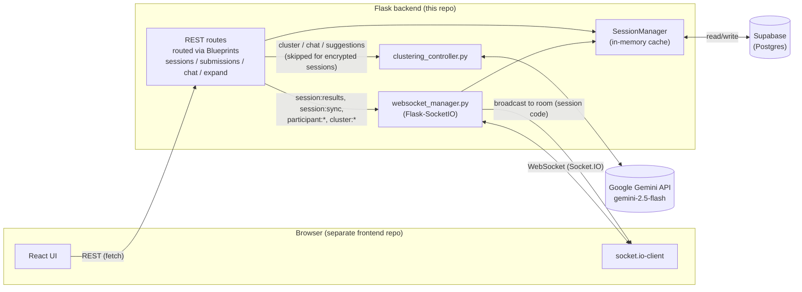
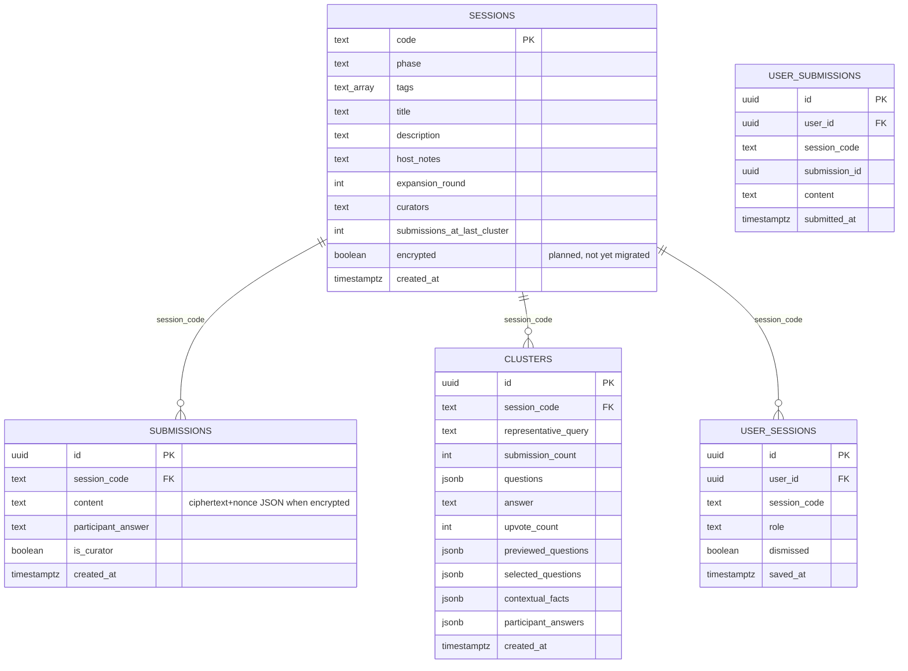
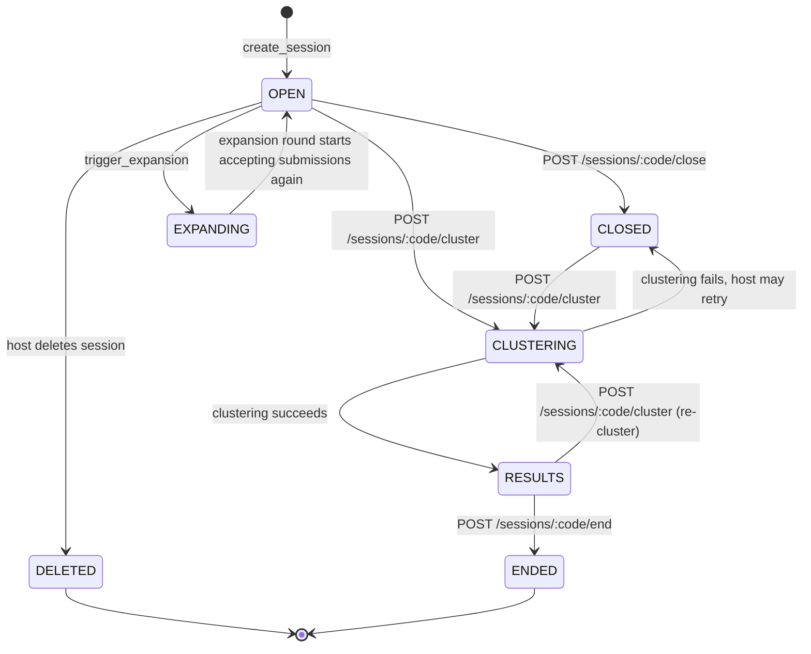
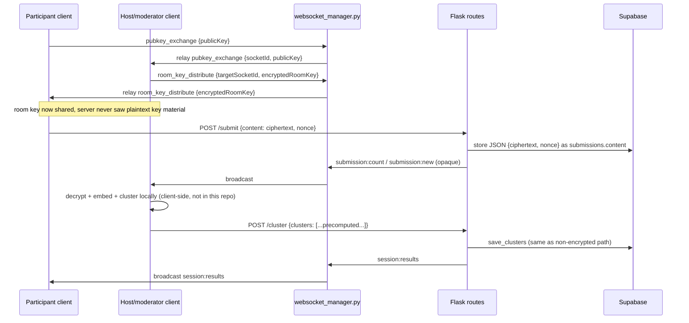

# PopularVote Technical Design Document, v5.0 Update

Date: 2026-09-18
Supersedes: `Design Document.pdf` (v4.0, 2026/03/17) on the points below only. Everything in v4.0 not
contradicted here (UX screens, session code scheme, no-auth model, upvoting, RAG answer suggestions)
still holds.

## Why this update exists

v4.0 documents a Node.js/Express backend with in-memory-only session state and no database. Neither
is true anymore:

- The backend was ported to **Python/Flask** (`app.py`, `managers/`, `routes/`). The v4.0 Key Decision
  Log entry "Node.js/Express over Python/Flask" is reversed; see the new decision below.
- Session, submission, and cluster state is now **persisted to Supabase (Postgres)**, not held only
  in server memory. In-memory dicts in `SessionManager` are a cache hydrated from and written through
  to Supabase, not the source of truth across restarts.
- The feature set grew past what v4.0 describes: curator promotion, session expansion rounds,
  PDF-sourced host notes feeding a RAG-style suggested-answer and chat flow, and (in progress) optional
  E2E encryption with client-side clustering for encrypted sessions.

## Key Decision Log additions

**Python/Flask over Node.js/Express (reverses the v4.0 decision)**
Decision: the backend is Flask, not Express.
Reason: team ended up needing Python-side libraries (`pypdf` for host-notes PDF extraction,
`google-genai`'s Python SDK) and consolidated on one runtime rather than splitting Node for sockets
and Python for AI/PDF tooling. `Flask-SocketIO` with `eventlet` covers the async/WebSocket need that
originally motivated picking Express.
Impact: `managers/websocket_manager.py` replaces the Socket.IO server-side code; route files under
`routes/` replace Express route handlers; `gunicorn` + `eventlet` replace the Node process model in
production.

**Supabase persistence over in-memory-only state**
Decision: `sessions`, `submissions`, and `clusters` are Postgres tables (see
`PostgreSQL Tables.txt`), read through `database/session_store.py`. `SessionManager` keeps an
in-memory dict (`self.sessions`) as a cache, hydrated on boot via `hydrate()` and lazily via
`get_session_async()` for codes not yet cached.
Reason: NFR5 (no retention after a session ends) is now enforced by explicit deletion
(`delete_session`) rather than by the absence of a database. Persistence buys resilience across
server restarts and multiple server instances, which the v4.0 in-memory design explicitly gave up.
Impact: every mutation in `SessionManager` writes through to `SessionStore` alongside updating the
cached dict. A DB write failure is logged but does not roll back the in-memory update (see
`create_session`, `update_context`, `update_host_notes` for the established best-effort pattern used
when a column may not exist yet on a given deploy).

**Optional per-session E2E encryption (new, in progress)**
Decision: sessions can opt into an `encrypted` flag at creation. Encrypted sessions route submission
content and clustering through client-side crypto and client-side embeddings instead of sending
plaintext to the server or to Gemini; the server only relays opaque blobs and accepts pre-computed
cluster results.
Reason: threat model extension beyond NFR1/NFR2 (anonymity, session privacy) to also protect
submission content from server-side or database-level compromise, for sessions where that matters
more than AI-assisted clustering quality.
Impact: `pubkey_exchange` and `room_key_distribute` socket events relay key material without the
server reading it; `POST /sessions/<code>/submit` accepts a `nonce` alongside ciphertext; `POST
/sessions/<code>/cluster` skips Gemini for encrypted sessions and expects the moderator client to
supply computed clusters; `POST /chat` refuses to run for encrypted sessions since it would otherwise
send ciphertext to Gemini as if it were plaintext. Client-side crypto/clustering modules live in the
separate frontend repository and are out of scope for this backend-side document.

---

## Diagrams

All diagrams below are Mermaid and can be pasted directly into any Mermaid renderer
(mermaid.live, a Mermaid-enabled Markdown viewer, or `mmdc`).

### 1. Architecture diagram (current)

### 2. Data model (matches `PostgreSQL Tables.txt`)

### 3. Session phase state machine (matches `managers/session_manager.py` `PHASES`)

### 4. Encrypted session flow (Phase 1/2/3 of the E2E plan, server side only)

---

## Open items carried over from `E2E CLUSTERING PLAN.md`

- Add the `encrypted boolean not null default false` column to `sessions` in Supabase (not yet run).
- Client-side crypto (`crypto.js`) and clustering (`clustering.js`) modules live in the frontend repo,
  which is not part of this codebase.
- Key-exchange trust model (no identity verification against an active MITM) and room-key durability
  across moderator reconnects are still open design questions, not yet resolved in code.
