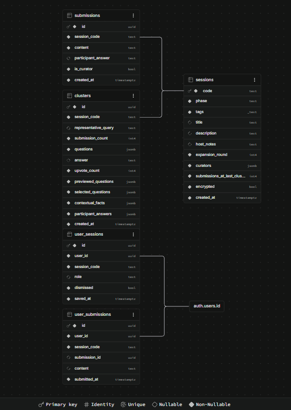

# PostgreSQL Schema (v4900)

The database is PostgreSQL on Supabase. The runnable script is [PostgreSQL Schema.sql](PostgreSQL%20Schema.sql). This page explains it. The previous schema (v3171) is kept in [../legacy_documents/](../legacy_documents/).

## Setup

1. Create a Supabase project (v4900 uses `https://pqrbpzfakmvdfjtniyzd.supabase.co`).
2. Open **SQL Editor**, paste the whole of `PostgreSQL Schema.sql`, and run it. It is safe to run again, since it uses `if not exists` and replaces its own policies.
3. Set the keys:
   - Backend, `src/backend/.env`: `SUPABASE_URL` and `SUPABASE_SERVICE_ROLE_KEY`.
   - Frontend, `src/frontend/.env` (and the root `.env` for Docker): `VITE_SUPABASE_URL` and `VITE_SUPABASE_ANON_KEY`. Vite bakes these in at build time, so rebuild after changing them.
4. In **Authentication**, enable the Google provider and set the Site URL and redirect URLs. Email sign-in needs no setup.

Keep the service_role key out of git. It bypasses row level security.

## Schema diagram

Screenshot from the Supabase schema visualizer after running the script. The Mermaid version is in [diagrams/02-schema.png](diagrams/02-schema.png).

## Tables

| Table | Written by | Purpose |
|---|---|---|
| `sessions` | backend | One row per session: join `code`, `phase`, tags, title, description, host notes, curators, `encrypted` flag. |
| `submissions` | backend | Participant questions. For encrypted sessions `content` is `{"ciphertext": "...", "nonce": "..."}` and the server never holds the key. |
| `clusters` | backend | AI or client-built groups of submissions, with the host's answer, upvotes, expansion questions and facts. |
| `user_sessions` | browser, signed in | Session history for the sidebar. |
| `user_submissions` | browser, signed in | A signed-in user's own copy of their questions. Not written for encrypted sessions, so plaintext never reaches the database. |

`submissions` and `clusters` cascade-delete with their session. `user_sessions` and `user_submissions` cascade-delete with the Supabase Auth user.

The backend keeps an in-memory cache of sessions, hydrated from and written through to these tables. The database is the source of truth after a restart.

## Changes from v3171

- `sessions.curators` is `jsonb` instead of `text`. The backend writes a list, and reading it back from `text` returned a string after a restart.
- Row level security is on for every table. The old schema disabled it and granted `anon` full access, and the anon key ships in the frontend bundle.
- Indexes on `session_code` lookups, and `NOT NULL` on foreign keys and defaults.
- Encrypted submissions need no new column. The ciphertext JSON fits in `submissions.content`.

## Access model

| Role | What it can do |
|---|---|
| `service_role` (Flask backend) | Everything. Bypasses RLS. |
| `anon` and `authenticated` (browser) | Read `code`, `phase`, `tags`, `title`, `created_at` on `sessions` only. |
| `authenticated` | Full access to their own `user_sessions` and `user_submissions` rows (`auth.uid() = user_id`). |
| `anon` | Nothing else. |

`submissions` and `clusters` have RLS on and no policies, so the browser cannot read or change them. All access goes through the Flask API.

## Known limits

- Anyone who knows or guesses a session code can read its public columns. Codes are the only access control for sessions.
- The browser never gets `host_notes`, `curators` or the `encrypted` flag directly. The backend sends `encrypted` over the socket on join.

## Attribute

Qwen3.5:4b & https://stackedit.io/
